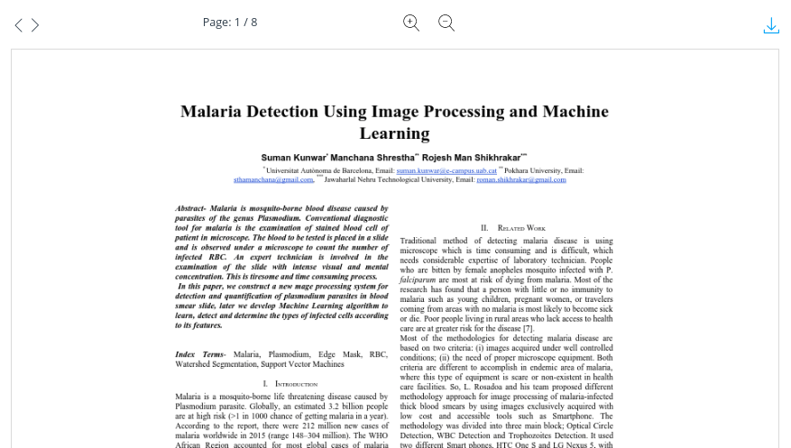

# react-typescript-pdf-reader

[](https://github.com/sumn2u/react-typescript-pdf-reader/issues) [](https://github.com/sumn2u/react-typescript-pdf-reader/network) [](https://github.com/sumn2u/react-typescript-pdf-reader/stargazers) [](https://github.com/sumn2u/react-typescript-pdf-reader/blob/master/LICENSE) [](https://twitter.com/intent/tweet?text=Wow:&url=https%3A%2F%2Fgithub.com%2Fsumn2u%2Freact-typescript-pdf-reader)
[](https://app.fossa.io/projects/git%2Bgithub.com%2Fsumn2u%2Freact-typescript-pdf-reader?ref=badge_shield)



> Pdf reader for create react app


## Demo

[https://sumn2u.github.io/react-typescript-pdf-reader/](https://sumn2u.github.io/react-typescript-pdf-reader/)

## Table of Contents

- [Install](#install)
- [Usage](#usage)
- [Testing](#testing)
- [Contribute](#contribute)
- [License](#license)


## Install

```sh
npm i react-typescript-pdf-reader -S

# or

yarn add react-typescript-pdf-reader

```

## Usage

```ts
import PDFReader from 'react-typescript-pdf-reader'

state = {
    pdfUrl: 'https://arxiv.org/pdf/1801.10031v1.pdf' // or use any pdf url
}

render(){
 let { pdfUrl } = this.state

   <PDFReader pdfUrl={pdfUrl} />
}


```
```
## Params

| Name                | Type     | Default    | Description                                                          |
| ------------------- | -------- | ---------- | -------------------------------------------------------------------- |
| `pdfUrl`            | PDF      | `null`     | **Required.** The pdf file which you are going to display            |

```

## Testing

`npm run test` or `yarn run test`

## Contribute


Small note: If editing the README, please conform to the [standard-readme](https://github.com/RichardLitt/standard-readme) specification.

## License

MIT © sumn2u


[](https://app.fossa.io/projects/git%2Bgithub.com%2Fsumn2u%2Freact-typescript-pdf-reader?ref=badge_large)